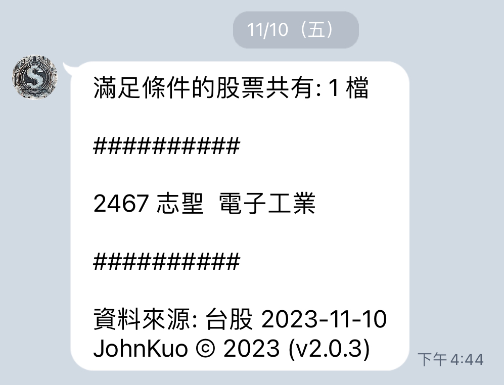

# 💵 Stock-Overflow 💶


## 🔎 Overview
**Stock-Overflow** is a **stock recommendation system** tailored for the Taiwanese stock market. It leverages various strategies and indicators to identify potentially lucrative stock investment opportunities. Specifically, the system automatically collects daily stock data through web scraping, applies fundamental, technical, and chip analysis to filter this information, and delivers recommendations to users via the LINE messaging platform.


## 📌 Features
- **Highly Customizable Filtering Criteria:** Tailor screening conditions to match specific investment preferences, allowing users to define criteria that align with their unique strategies.

- **Convenient Daily Push Notifications via LINE:** Enjoy the convenience of receiving daily stock recommendations directly through LINE messaging, ensuring users stay informed without the need for manual checks.


## 🪄 Deployment Tools
- **Web Service:** [Render](https://render.com/)
- **Scheduler:** [Cron-job](https://cron-job.org/en/)
- **LINE Chatbot:** [LINE Developers](https://developers.line.biz/zh-hant/)


## 🔖 How to Deploy the Service
1. Modify the **`render.yaml`** file in your repository. (You can also find the template [here](https://github.com/haojiwu/line-bot-python-on-render).)
    - Modify the value of `name`, `repo`, and maybe some values of `envVars`.

2. Go to **Render**'s [blueprint](https://dashboard.render.com/blueprints), create a new instance with the target repository and the **`render.yaml`** file.
    - The environment variables `CHANNEL_ACCESS_TOKEN` and `CHANNEL_SECRET` can be found from [LINE Developers](https://developers.line.biz/zh-hant/).
    - The environment variable `API_ACCESS_TOKEN` should be a random value to enhance the security.

3. Upon creating and running the instance, you will receive a service URL for this web service from the dashboard (e.g., https://stock-overflow-api.onrender.com).

4. Append `/callback` to the service URL to construct the webhook URL. Paste this webhook URL into the `LINE Webhook URL` section on [LINE Developers](https://developers.line.biz/zh-hant/).

5. Configure the scheduler (e.g., [Cron-job](https://cron-job.org/en/)) to invoke the API endpoints using the following settings:
    - Invoke the `/update` API endpoint every day at **18:00** to retrieve the stock recommendation list and ensure users receive notifications. For details regarding the configuration of the API access token, please refer to [Issue #1](https://github.com/yujunkuo/Stock-Overflow/issues/1).
    - Invoke the `/wakeup` API endpoint every **5 minutes** to prevent the free instance from spinning down due to inactivity, and simultaneously release unreferenced memory usage.


## 💬 LINE Notification Message
Below is an example of what the LINE notification message looks like:




## ⚠️ Disclaimer and Customization
**Please** note that Stock-Overflow is a stock recommendation system offering investment advice for informational purposes only. We do not assume any responsibility for financial decisions made based on our recommendations. Investing in the stock market involves risks, and users are advised to exercise caution and conduct their own research before making any investment decisions.

**Moreover,** it's also important to note that the system's default investment strategy is geared towards "short-term trading." Nevertheless, users have the flexibility to adjust filtering criteria based on their individual investment preferences. They can modify the source code's stock screening conditions to better align with their unique strategies. Feel free to explore and adapt the criteria to match your preferences and risk tolerance.


## 🧷 Reference
- https://render.com/
- https://cron-job.org/en/
- https://developers.line.biz/en/
- https://ithelp.ithome.com.tw/articles/10283836
- https://github.com/haojiwu/line-bot-python-on-render
- https://bamorlove.com/blog/render
- https://api-docs.render.com/reference/restart-server


## 🧸 Contribution
Contributions are greatly welcome and appreciated! If you have any idea for enhancements, please don't hesitate to create a pull request. Thank you for being a crucial part of this project and for bringing your unique brilliance to the table! Let's create something extraordinary together! 


## 📅 Update Info
If you need to automate restarting the service, Render now supports this via an API call. Just make a POST request to https://api.render.com/v1/services/{service-id}/restart. You can find the `service-id` by looking at the URL after entering the project (format: `srv-xxxxx`).

You should also include your `api-key` in the request via the Authorization HTTP header. You can create API keys from your [Account Settings page](https://dashboard.render.com/u/settings) in the Render Dashboard.

Here is an example:
```bash
curl --request POST \
     --url https://api.render.com/v1/services/{service-id}/restart \
     --header 'accept: application/json' \
     --header 'authorization: Bearer {api-key}'
```